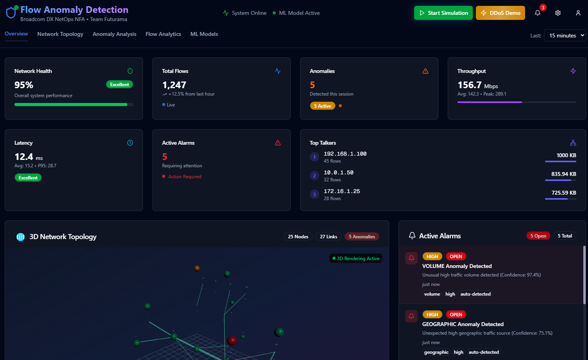
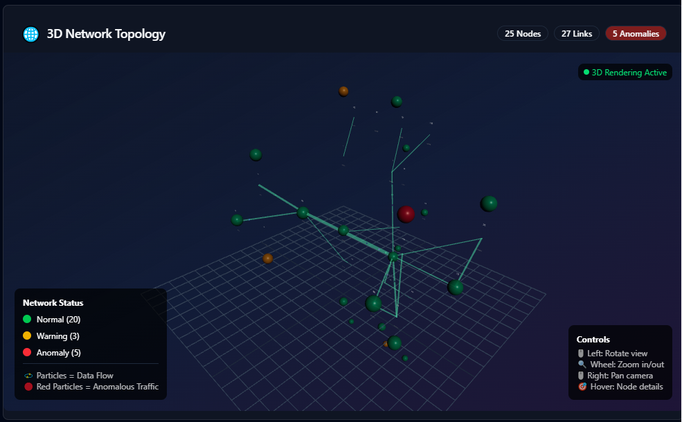
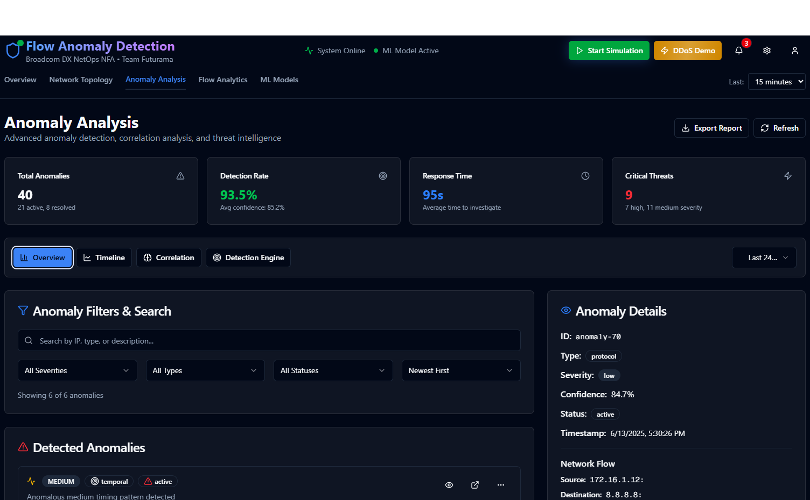
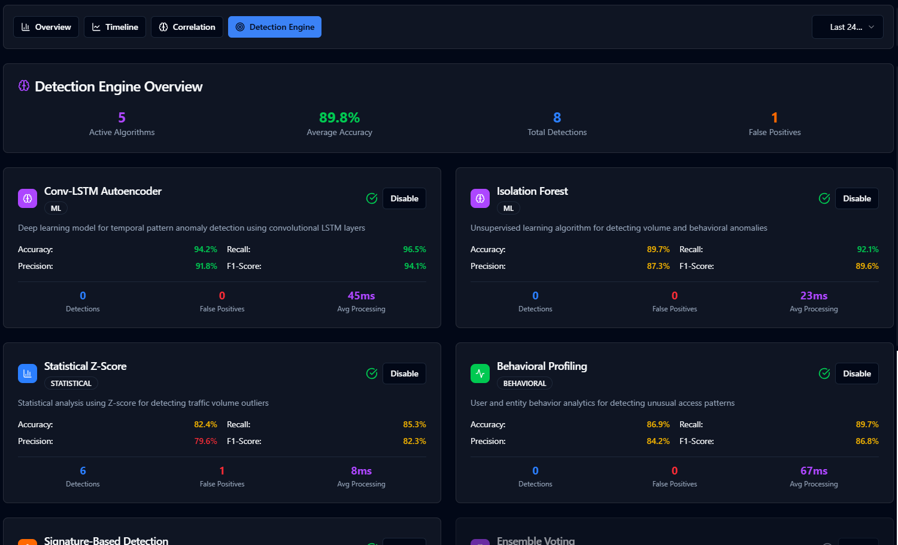
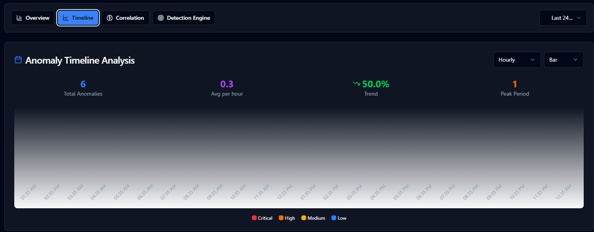
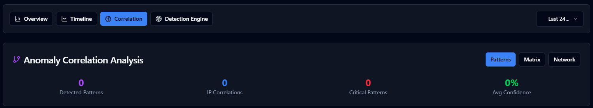

# 🌐 Flow Anomaly Detection Dashboard

**Real-time Network Security Monitoring with Advanced 3D Visualization**

A cutting-edge network monitoring and anomaly detection system featuring an immersive 3D network topology visualization, real-time threat detection, and comprehensive security analytics. Built for enterprise network security teams and cybersecurity professionals.

    

## 🌟 Live Demo

**🚀 [View Live Dashboard](https://flow-anomaly-detection.vercel.app)** - Experience the full interactive dashboard

**📊 [Network Topology](https://flow-anomaly-detection.vercel.app/network-topology)** - Enhanced 3D network visualization with advanced filtering

**🔍 [Anomaly Analysis](https://flow-anomaly-detection.vercel.app/anomaly-analysis)** - Comprehensive anomaly detection and correlation analysis

> **Current Status**: ✅ Successfully deployed and operational on Vercel with full 3D network topology, advanced anomaly analysis with 6 ML algorithms, interactive timeline analysis, correlation patterns, real-time detection, and comprehensive dashboard features.

## 📸 Screenshots

### Main Dashboard Overview

*Real-time network monitoring with comprehensive metrics, active alarms, and performance indicators*

### Enhanced Network Topology

*Interactive 3D network visualization with advanced filtering, search capabilities, and multiple view modes*

### Anomaly Analysis Dashboard

*Comprehensive anomaly analysis with detection engine overview, timeline analysis, and correlation patterns*

### Detection Engine Management

*Advanced ML algorithms including Conv-LSTM Autoencoder, Isolation Forest, and Behavioral Profiling with real-time performance metrics*

### Interactive Timeline Analysis

*Historical anomaly patterns with interactive timeline, severity breakdown, and temporal clustering detection*

### Correlation & Pattern Recognition

*Advanced correlation matrix, pattern detection, and network relationship analysis for coordinated attack identification*

## 🚀 Project Overview

The Flow Anomaly Detection Dashboard is a sophisticated network security monitoring solution that combines machine learning-powered anomaly detection with stunning 3D network visualization. It provides real-time insights into network traffic patterns, security threats, and system performance through an intuitive, interactive interface.

### 🎯 Key Capabilities

- **Real-time Network Monitoring**: Live tracking of network flows, bandwidth utilization, and connection patterns
- **AI-Powered Anomaly Detection**: Machine learning models detect suspicious activities and security threats
- **3D Network Topology**: Interactive 3D visualization of enterprise network infrastructure
- **Threat Intelligence**: Comprehensive analysis of network anomalies with confidence scoring
- **Performance Analytics**: Real-time metrics for latency, throughput, and system health

## ✨ Key Features

### 🔍 Advanced Anomaly Detection
- **ML Model Integration**: Conv-LSTM Autoencoder with 94%+ accuracy
- **Multi-dimensional Analysis**: Volume, pattern, protocol, geographic, and temporal anomaly detection
- **Confidence Scoring**: AI confidence levels for each detected anomaly
- **Real-time Alerts**: Instant notifications for critical security events

### 🧠 Detection Engine Algorithms
- **Conv-LSTM Autoencoder**: Deep learning model for temporal pattern detection (94.2% accuracy)
- **Isolation Forest**: Unsupervised learning for volume and behavioral anomalies (89.7% accuracy)
- **Statistical Z-Score**: Statistical analysis for traffic volume outliers (82.4% accuracy)
- **Behavioral Profiling**: User and entity behavior analytics (86.9% accuracy)
- **Signature-Based Detection**: Rule-based detection using known attack patterns (95.8% accuracy)
- **Ensemble Voting**: Meta-algorithm combining multiple detection methods (96.3% accuracy)

### 📊 Timeline & Historical Analysis
- **Interactive Timeline**: Hourly, daily, and weekly anomaly pattern visualization
- **Temporal Clustering**: Detection of coordinated attacks within time windows
- **Trend Analysis**: Statistical trend identification with percentage changes
- **Historical Correlation**: Pattern matching across different time periods
- **Peak Period Analysis**: Identification of high-activity anomaly periods

### 🔗 Correlation & Pattern Recognition
- **Coordinated Attack Detection**: Multi-target attack pattern identification
- **Geographic Clustering**: Subnet-based anomaly grouping and analysis
- **Volumetric Pattern Recognition**: DDoS and traffic surge detection
- **IP Correlation Matrix**: Network relationship analysis with correlation scoring
- **Behavioral Pattern Matching**: User activity deviation detection
- **Threat Classification**: Automatic categorization by severity (Low, Medium, High, Critical)

### 🔬 Advanced Anomaly Analysis Dashboard
- **Multi-Algorithm Detection Engine**: Six sophisticated ML algorithms working in parallel
  - **Conv-LSTM Autoencoder**: 94.2% accuracy for temporal pattern detection
  - **Isolation Forest**: 89.7% accuracy for unsupervised anomaly detection
  - **Statistical Z-Score**: 82.4% accuracy for traffic volume outliers
  - **Behavioral Profiling**: 86.9% accuracy for user behavior analytics
  - **Signature-Based Detection**: 95.8% accuracy using known attack patterns
  - **Ensemble Voting**: 96.3% accuracy combining multiple methods
- **Interactive Timeline Analysis**: Hourly, daily, and weekly anomaly visualization with trend analysis
- **Correlation Matrix**: Advanced IP correlation analysis with relationship scoring
- **Pattern Recognition**: Coordinated attack detection and geographic clustering
- **Real-time Simulation**: Live anomaly generation with burst attack scenarios
- **Advanced Filtering**: Multi-dimensional filtering by severity, type, confidence, and time range
- **Detailed Inspection**: Comprehensive anomaly details with network flow analysis
- **Export Capabilities**: Report generation and data export functionality

### 🌐 3D Network Visualization
- **Interactive 3D Topology**: Immersive network visualization using Three.js/React Three Fiber
- **Realistic Enterprise Network**: 25+ nodes including servers, routers, switches, firewalls, and clients
- **Animated Data Flows**: Real-time particle animations showing network traffic
- **Color-coded Status Indicators**:
  - 🟢 **Green**: Normal operation
  - 🟡 **Yellow**: Warning state
  - 🔴 **Red**: Critical issues
  - 🔴 **Pulsing Red**: Active anomalies
- **Interactive Controls**:
  - Orbital camera controls (zoom, pan, rotate)
  - Node hover tooltips with detailed metrics
  - Performance-optimized 60fps rendering

### � Multi-Page Navigation
- **Overview Dashboard** (`/`): Main dashboard with real-time metrics and 3D network overview
- **Network Topology** (`/network-topology`): Enhanced 3D network visualization with advanced filtering and search
- **Anomaly Analysis** (`/anomaly-analysis`): ✅ **Complete** - Advanced anomaly detection with 6 ML algorithms, interactive timeline analysis, correlation patterns, and real-time threat intelligence
- **Flow Analytics** (`/flow-analytics`): Traffic flow analysis and bandwidth monitoring (coming soon)
- **ML Models** (`/ml-models`): Machine learning model management and training interface (coming soon)

### �📊 Comprehensive Dashboard
- **Real-time Metrics**: Live network health, flow statistics, and performance indicators
- **Active Alarms Panel**: Current security alerts with detailed information
- **Top Talkers Analysis**: Identification of highest traffic sources
- **Network Performance**: Latency monitoring and throughput analysis
- **Responsive Design**: Optimized for desktop and mobile viewing

### 🏢 Enterprise Network Simulation
- **Realistic IP Addressing**: Internal subnets (192.168.x.x, 10.0.x.x, 172.16.x.x)
- **Multi-tier Architecture**: DMZ, internal servers, department networks, IoT devices
- **Device Types**: Servers, routers, switches, firewalls, workstations, IoT sensors
- **Network Segmentation**: Proper enterprise network topology with security zones

## 🛠️ Technology Stack

### Frontend Framework
- **Next.js 14**: React framework with App Router and server-side rendering
- **React 18**: Modern React with hooks and concurrent features
- **TypeScript**: Type-safe development with full IntelliSense support

### 3D Visualization
- **Three.js**: WebGL-based 3D graphics library
- **React Three Fiber**: React renderer for Three.js
- **React Three Drei**: Useful helpers and abstractions for R3F

### UI/UX
- **Tailwind CSS**: Utility-first CSS framework for rapid styling
- **Shadcn/ui**: High-quality, accessible React components
- **Lucide React**: Beautiful, customizable icons

### Data & State Management
- **TypeScript Interfaces**: Strongly typed data models
- **React Hooks**: Modern state management with useState, useEffect, useMemo
- **Custom Data Generator**: Realistic network data simulation

### Performance & Optimization
- **60fps Rendering**: Optimized 3D performance for smooth interactions
- **Lazy Loading**: Component-based code splitting
- **Responsive Design**: Mobile-first approach with breakpoint optimization

## 🗺️ Development Roadmap

### ✅ Successfully Completed Features (Phases 1 & 2)
- [x] **Core Dashboard Infrastructure**
  - [x] Next.js 15.3.3 application setup with TypeScript
  - [x] Responsive dashboard layout with dark theme
  - [x] Real-time metrics overview (Network Health, Total Flows, Anomalies, Throughput, Latency)
  - [x] Active alarms panel with severity indicators
  - [x] Top talkers analysis with traffic volume metrics

- [x] **3D Network Visualization**
  - [x] Interactive 3D network topology using React Three Fiber
  - [x] 25+ realistic enterprise network nodes (servers, routers, switches, firewalls, clients)
  - [x] Animated data flow particles with anomaly detection
  - [x] Color-coded status indicators (green=normal, yellow=warning, red=critical, pulsing red=anomaly)
  - [x] Orbital controls (zoom, pan, rotate) with performance optimization
  - [x] Node hover tooltips with detailed metrics and anomaly information

- [x] **Data Generation & Simulation**
  - [x] Realistic enterprise network topology generator
  - [x] Network flow simulation with normal and anomalous patterns
  - [x] ML-powered anomaly detection with confidence scoring
  - [x] Real-time alarm generation and management
  - [x] DDoS attack simulation capabilities

- [x] **Deployment & Production**
  - [x] Successful Vercel deployment with CI/CD
  - [x] TypeScript compilation and build optimization
  - [x] Performance monitoring and error boundaries
  - [x] Mobile-responsive design implementation

- [x] **Enhanced Network Topology Screen**
  - [x] Advanced node filtering and search functionality
  - [x] Multiple view modes (topology, performance, security)
  - [x] Real-time network status monitoring with enhanced tooltips
  - [x] Interactive node selection and highlighting
  - [x] Enhanced data flow animations and visual effects

- [x] **Anomaly Analysis Screen** (Priority 2)
  - [x] Dedicated anomaly analysis dashboard with comprehensive overview
  - [x] Advanced detection engine with 6 ML algorithms (Conv-LSTM, Isolation Forest, Statistical Z-Score, Behavioral Profiling, Signature-Based, Ensemble Voting)
  - [x] Interactive timeline analysis with hourly/daily/weekly views
  - [x] Anomaly correlation and pattern recognition system
  - [x] Enhanced severity classification with contextual risk scoring
  - [x] Advanced filtering and search capabilities
  - [x] Real-time anomaly simulation and burst generation
  - [x] Detailed anomaly inspection with network flow analysis

### 📋 Upcoming Features (Phase 3)
- [ ] **Flow Analytics Screen**
  - [ ] Comprehensive flow analytics dashboard
  - [ ] Traffic pattern analysis and visualization
  - [ ] Top talkers, protocols, and ports analysis
  - [ ] Flow trend analysis with time-series charts
  - [ ] Bandwidth utilization and performance metrics

- [ ] **ML Models Management Screen**
  - [ ] ML model management interface
  - [ ] Model training status and metrics dashboard
  - [ ] Model performance monitoring and evaluation
  - [ ] Model versioning and deployment controls
  - [ ] Explainable AI features for model interpretability

### 🔮 Future Enhancements (Phase 4)
- [ ] **Real NetFlow Integration**
  - [ ] NetFlow v5/v9/IPFIX protocol support
  - [ ] Real-time data ingestion pipeline
  - [ ] Data preprocessing and normalization
  - [ ] Historical data storage and retrieval

- [ ] **Advanced Security Features**
  - [ ] Threat intelligence integration
  - [ ] Behavioral analysis and user profiling
  - [ ] Automated incident response workflows
  - [ ] Security orchestration and automation (SOAR)

- [ ] **Enterprise Features**
  - [ ] Multi-tenant support
  - [ ] Role-based access control (RBAC)
  - [ ] API endpoints for external integrations
  - [ ] Custom alerting and notification systems

## 🚀 Installation & Setup

### Prerequisites
- **Node.js** 18.0 or higher
- **npm**, **yarn**, or **pnpm** package manager
- Modern web browser with WebGL support

### Quick Start

1. **Clone the Repository**
   ```bash
   git clone <repository-url>
   cd flow-anomaly-detection
   ```

2. **Install Dependencies**
   ```bash
   npm install
   # or
   yarn install
   # or
   pnpm install
   ```

3. **Start Development Server**
   ```bash
   npm run dev
   # or
   yarn dev
   # or
   pnpm dev
   ```

4. **Open in Browser**
   Navigate to [http://localhost:3000](http://localhost:3000) to view the dashboard

### Build for Production

```bash
npm run build
npm start
```

## 📖 Usage Guide

### 🎮 3D Visualization Controls

- **🖱️ Left Click + Drag**: Rotate the 3D view around the network
- **🔍 Mouse Wheel**: Zoom in/out for detailed or overview perspective
- **🖱️ Right Click + Drag**: Pan the camera position
- **🎯 Hover over Nodes**: Display detailed information tooltips

### 📊 Dashboard Navigation

1. **Network Health Metrics**: Monitor overall system performance
2. **Active Alarms**: Review current security alerts and anomalies
3. **3D Network View**: Interact with the live network topology
4. **Top Talkers**: Identify high-traffic network sources
5. **Recent Anomalies**: Track historical security events

### 🔍 Interpreting Anomalies

- **Volume Anomalies**: Unusual traffic volume patterns
- **Pattern Anomalies**: Abnormal communication behaviors
- **Protocol Anomalies**: Suspicious protocol usage
- **Geographic Anomalies**: Unexpected traffic sources
- **Temporal Anomalies**: Time-based pattern deviations

## 🏗️ Architecture

### Component Structure
```
src/
├── app/                    # Next.js App Router
│   ├── anomaly-analysis/  # Anomaly analysis page
│   ├── network-topology/  # Enhanced network topology page
│   └── page.tsx           # Main dashboard
├── components/
│   ├── 3d/                # 3D visualization components
│   ├── anomaly/           # Anomaly analysis components
│   │   ├── AnomalyDetectionEngine.tsx
│   │   ├── AnomalyTimeline.tsx
│   │   ├── AnomalyCorrelation.tsx
│   │   └── AnomalyList.tsx
│   ├── dashboard/         # Dashboard widgets
│   └── ui/                # Reusable UI components
├── lib/                   # Utilities and data generation
├── types/                 # TypeScript type definitions
└── styles/               # Global styles and Tailwind config
```

### Data Flow
1. **Data Generation**: Realistic network data simulation
2. **Anomaly Detection**: ML model processing and threat identification
3. **3D Rendering**: Real-time visualization updates
4. **User Interaction**: Responsive UI updates and tooltips

## 🎪 Demo Features

### Hackathon-Ready Capabilities

- **🔴 Live Anomaly Simulation**: Real-time detection of network threats
- **🌐 Interactive 3D Network**: Impressive visual demonstration
- **📊 Professional Dashboard**: Enterprise-grade monitoring interface
- **⚡ High Performance**: Smooth 60fps 3D rendering
- **📱 Responsive Design**: Works on all device sizes
- **🎨 Modern UI**: Sleek, professional appearance

### Demo Scenarios

1. **DDoS Attack Detection**: Visualize volumetric attacks with pulsing red nodes and correlation analysis
2. **Port Scanning Activity**: Monitor suspicious reconnaissance attempts with behavioral profiling
3. **Geographic Anomalies**: Detect traffic from unexpected locations using ML algorithms
4. **Protocol Violations**: Identify unusual network protocol usage with signature-based detection
5. **Coordinated Attack Simulation**: Generate burst anomalies for correlation pattern analysis
6. **Timeline Analysis**: Interactive exploration of anomaly trends across different time periods
7. **ML Algorithm Comparison**: Real-time performance metrics across 6 detection algorithms
8. **Performance Monitoring**: Real-time network health assessment with confidence scoring

## 🔧 Configuration

### Environment Variables
Create a `.env.local` file for custom configuration:

```env
# API Configuration
NEXT_PUBLIC_API_URL=http://localhost:3000/api
NEXT_PUBLIC_WS_URL=ws://localhost:3000/ws

# 3D Visualization Settings
NEXT_PUBLIC_MAX_NODES=50
NEXT_PUBLIC_RENDER_FPS=60
NEXT_PUBLIC_ENABLE_SHADOWS=false

# Anomaly Detection
NEXT_PUBLIC_ML_MODEL_ENDPOINT=/api/ml/detect
NEXT_PUBLIC_CONFIDENCE_THRESHOLD=0.7
```

### Customization Options

- **Network Topology**: Modify `src/lib/data-generator.ts` to customize network structure
- **Anomaly Models**: Extend ML detection algorithms in anomaly detection logic
- **UI Themes**: Customize colors and styling in Tailwind configuration
- **Performance**: Adjust 3D rendering settings for different hardware capabilities

## 🧪 Development

### Project Structure Deep Dive

```
flow-anomaly-detection/
├── src/
│   ├── app/
│   │   ├── globals.css           # Global styles and Tailwind imports
│   │   ├── layout.tsx            # Root layout component
│   │   └── page.tsx              # Main dashboard page
│   ├── components/
│   │   ├── 3d/
│   │   │   └── NetworkVisualization.tsx  # 3D network component
│   │   ├── dashboard/
│   │   │   ├── MetricCard.tsx    # Reusable metric display
│   │   │   ├── AlarmPanel.tsx    # Security alerts panel
│   │   │   └── TopTalkers.tsx    # Network traffic analysis
│   │   └── ui/                   # Shadcn/ui components
│   ├── lib/
│   │   ├── data-generator.ts     # Network data simulation
│   │   └── utils.ts              # Utility functions
│   ├── types/
│   │   └── index.ts              # TypeScript definitions
│   └── styles/
├── public/                       # Static assets
├── package.json                  # Dependencies and scripts
├── tailwind.config.js           # Tailwind CSS configuration
├── tsconfig.json                # TypeScript configuration
└── next.config.js               # Next.js configuration
```

### Adding New Features

1. **New Anomaly Types**: Extend the `AnomalyDetection` interface in `types/index.ts`
2. **Additional Metrics**: Add new metric cards in the dashboard components
3. **3D Enhancements**: Modify the NetworkVisualization component for new visual features
4. **Data Sources**: Integrate real network data by replacing the data generator

### Testing

```bash
# Run type checking
npm run type-check

# Build and test production bundle
npm run build

# Start production server
npm start
```

## 🚀 Deployment

### ✅ Current Deployment Status

**Live Production Environment**: [https://flow-anomaly-detection.vercel.app](https://flow-anomaly-detection.vercel.app)

- **Platform**: Vercel
- **Status**: ✅ Successfully deployed and operational
- **Build**: Automated CI/CD pipeline with GitHub integration
- **Performance**: Optimized for global CDN delivery
- **SSL**: Automatic HTTPS with Vercel's edge network

### Vercel Deployment (Current Setup)

The application is currently deployed on Vercel with the following configuration:

1. **Automatic Deployments**: Every push to the `master` branch triggers a new deployment
2. **Build Configuration**: Next.js 15.3.3 with TypeScript compilation
3. **Environment**: Production-optimized build with performance monitoring
4. **Domain**: Custom domain with automatic SSL certificate

```bash
# Install Vercel CLI
npm i -g vercel

# Deploy to Vercel
vercel --prod
```

### Manual Deployment Steps

1. **Connect Repository**: Link your GitHub repository to Vercel
2. **Configure Build**: Vercel automatically detects Next.js configuration
3. **Deploy**: Automatic deployments on every push to main branch

### Docker Deployment

```dockerfile
FROM node:18-alpine

WORKDIR /app
COPY package*.json ./
RUN npm ci --only=production

COPY . .
RUN npm run build

EXPOSE 3000
CMD ["npm", "start"]
```

### Environment-Specific Builds

```bash
# Development
npm run dev

# Production
npm run build && npm start

# Static export (if needed)
npm run build && npm run export
```

## 🤝 Contributing

We welcome contributions to enhance the Flow Anomaly Detection Dashboard!

### Development Workflow

1. **Fork the Repository**
2. **Create Feature Branch**: `git checkout -b feature/amazing-feature`
3. **Commit Changes**: `git commit -m 'Add amazing feature'`
4. **Push to Branch**: `git push origin feature/amazing-feature`
5. **Open Pull Request**

### Code Standards

- **TypeScript**: All new code must be properly typed
- **ESLint**: Follow the established linting rules
- **Prettier**: Use consistent code formatting
- **Components**: Follow React best practices and hooks patterns

## 📄 License

This project is licensed under the MIT License - see the [LICENSE](LICENSE) file for details.

## 🙏 Acknowledgments

- **Three.js Community**: For the amazing 3D graphics library
- **React Three Fiber**: For the excellent React integration
- **Shadcn/ui**: For the beautiful, accessible UI components
- **Next.js Team**: For the powerful React framework
- **Tailwind CSS**: For the utility-first CSS framework

## 📞 Support & Contact

- **Issues**: Report bugs and feature requests via GitHub Issues
- **Documentation**: Comprehensive guides available in the `/docs` folder
- **Community**: Join our discussions in GitHub Discussions

---

**Built with ❤️ for the cybersecurity community**

*Empowering network security teams with cutting-edge visualization and AI-powered threat detection.*
